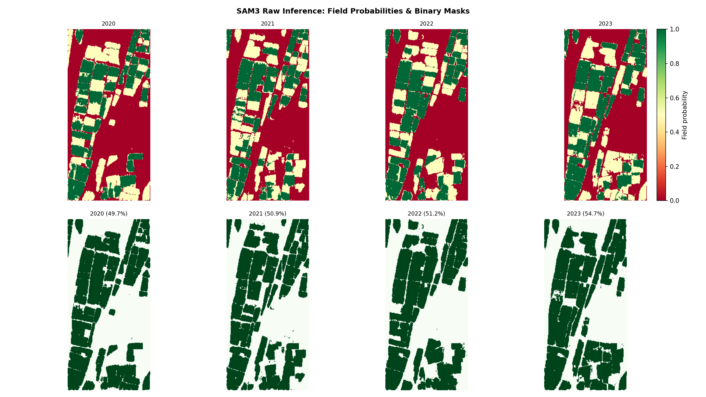
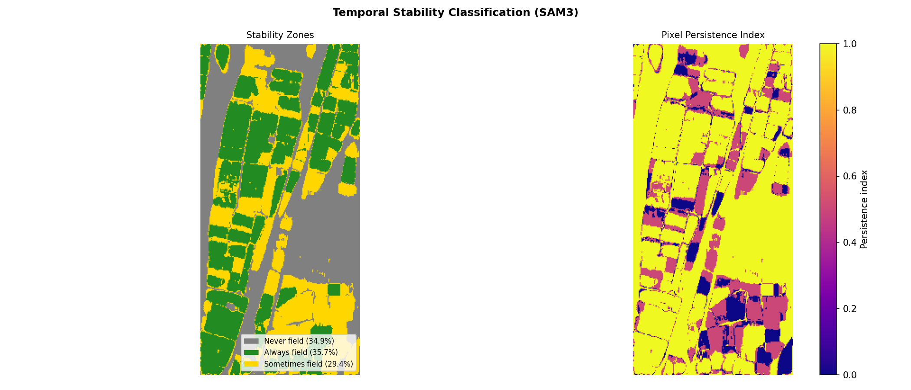

# Pheno-Boundary Detection using SAM3

Agricultural field delineation and temporal stability analysis over South Tyrol, Italy, using Meta's SAM3 model via the `samgeo3` library. The pipeline runs on Sentinel-2 bi-temporal composites (spring + summer) across four years (2020–2023).

---

## Data & Model

**Imagery**
- Sentinel-2 L2A, accessed via EOPF STAC (`stac.core.eopf.eodc.eu`)
- 4 years × 2 seasonal composites (spring / summer), bands B02 B03 B04 B08 at 10 m resolution
- Study area: South Tyrol, Italy — `[11.2908, 46.3565, 11.3151, 46.3890]` (EPSG:4326)

**Model**
- [SAM3 (Segment Anything Model 3)](https://github.com/opengeos/segment-geospatial) via `samgeo3`
- Prompted with 10 bounding boxes covering representative field parcels
- Raw binary masks are post-processed with the VITO graph-cut filter (Felzenszwalb superpixels + RAG merge)

**Ground truth**
- South Tyrol cadastral parcel shapefile for pixel-level and boundary-level validation

---
## How to Run this notebook

Copy this whole repo in your google drive directly `MyDrive\Pheno_boundary_detection_Pretrained_SamGeo3` then execute the python notebook in colab with GPU toggled.

---
## Results

**Inference Result Using BBox**

**Stability Zones**

**Temporal stability** (cross-year IoU, VITO-filtered masks)

| Pair | IoU |
|------|-----|
| 2020 – 2021 | 0.447 |
| 2021 – 2022 | 0.480 |
| 2022 – 2023 | 0.516 |

**Pixel-level validation** vs. cadastral parcels

| Year | Precision | Recall | F1 |
|------|-----------|--------|----|
| 2020 | 0.9941 | 0.3293 | 0.4947 | 
| 2021 | 0.9896 | 0.3098 | 0.4718 |
| 2022 | 0.9846 | 0.3652 | 0.5327 |
| 2023 | 0.9904 | 0.3913 | 0.5609 |

